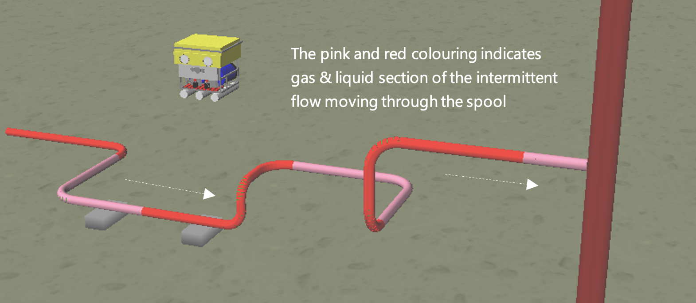

# Slugging & Multi-planar Spools - An ML Approach
**Goal** Predict Non-linear Structural Response using Machine Learning. 
   

   
The following Python jupyter notebooks contain the final code created for this project. The notebooks are sequentially numbered based on the order in which they are run to recreate the solution. **Caution:** Many of the functions have long run times.
- 1_create_fea_gen_files.ipynb
  - This notebook programmatically creates the **keyword** and **batch** files required to run the slugging analysis of the multi-planar spool configuration in **Flexcom** (the physics-based finite element analysis software). The results of the 50,000 simulations are post-processed using the next notebook.
- 2a_postprocess_fea_results_local.ipynb
  - This notebook is used to post-process the timetrace data generated from the **Flexcom** simulations. Displacement and bending moment ranges are extracted using this code and are later used as the target features for the machine learning modelling. Note that additional parameters are post-processed here. Only three are used in the project as target features. 
- 2b_postprocess_fea_results_azure.ipynb [NOT USED]
  - This notebook performs the same task as the previous (2a) but is based on the **Flexcom** files being located in Azure blob storage. This method was too slow hence was not used. Notebook 2a was used directly from the machines which contained the **Flexcom** timetrace results.
- 3_collate_and_understand_fea_results.ipynb
  - This notebook collates the input and output data to create the Analytics Base Table (ABT) for modelling. EDA is also performed and the load cases with the largest response are investigated to ensure that they are reasonable (this step involved reviewing the corresponding simulation animations).
- 4_prep_data.ipynb
  - Split data into training, validation and test datasets. The datasets are saved to the repo for modelling steps.
- 5_initial_ml_model_trials.ipynb
  - This is an initial modelling notebook to confirm general feasibility and understand modelling complexity.
- 6_NN_model_experiments.ipynb
  - This notebook contains the code developed to create the optimised NN model. This notebook uses the training and validation datasets. SHAP is used for feature value understanding.
- 7_final_model_tests.ipynb
  - This is the final notebook. In this notebook the models are retrained on the complete training dataset and performance measures are calclated for the hold-out test dataset.
